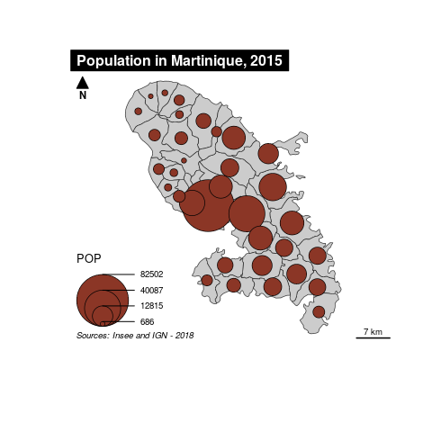
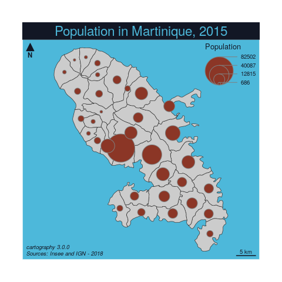

# cartography 

[](https://cran.r-project.org/package=cartography)
[](https://cran.r-project.org/package=cartography)
[](https://github.com/riatelab/cartography/actions)
[](https://codecov.io/gh/riatelab/cartography)
[](https://tinyverse.netlify.app/)
[](https://doi.org/10.21105/joss.00054)

## Create and integrate maps in your R workflow!

This package helps to design **cartographic representations** such as
proportional symbols, choropleth, typology, flows or discontinuities
maps. It also offers several features that improve the graphic
presentation of maps, for instance, map palettes, layout elements
(scale, north arrow, title…), labels or legends.

:warning: **Since cartography v3.0.0 most previously available functions
are deprecated and replaced by new ones.**  
Yes, this is a major change, yet it should not imply breaking changes.  
See [Roadmap](#roadmap) to discover the new functions and check what the
use of this new package API implies for your previous and future
cartographic workflows.

## Vignette

The
[vignette](https://CRAN.R-project.org/package=cartography/vignettes/cartography.html)
contains commented scripts on how to build various types of maps with
`cartography`:

[](https://CRAN.R-project.org/package=cartography/vignettes/cartography.html)

## Demo

The following script creates a map of symbols that are proportional to
values of a variable.

``` r
library(cartography)
mtq <- tc_import_mtq()
tc_map(mtq)
tc_map_p(mtq, "POP")
tc_layout(title = "Population in Martinique, 2015", 
          credits = "Sources: Insee and IGN - 2018")
```

<!-- -->

``` r
tc_theme("nevermind")
tc_map(mtq)
tc_map_p(x = mtq, 
         var = "POP", 
         inches = 0.25, 
         border = "grey50",
         lwd = 1, 
         leg_pos = "topright", 
         leg_title = "Population") 
tc_title("Population in Martinique, 2015")
tc_credits("cartography 2.1.3\nSources: Insee and IGN - 2018")
tc_scale(5)
tc_arrow("topleft")
```

<!-- -->

## Installation

-   Development version on GitHub

``` r
require(remotes)
install_github("riatelab/cartography")
```

-   Stable version on
    [CRAN](https://CRAN.R-project.org/package=cartography/)

``` r
install.packages("cartography")
```

## NEWS

The version 3.0.0 of `cartography` is a MAJOR update and introduces a
lot of novelties.  
Most of the previous functions are deprecaded and replaced by new
ones.  
However, your old code base built upon `cartography` can survive this
change.  
The old functions are declared depeprecated and will trigger a warning
when used. Theses warnings (generated by the `lifecyle` package) are not
invasives and can be hidden with
`options(lifecycle_verbosity = "quiet")` or
`cartography_legacy_mode("on")`.  
The old functions (and their warnings) will remain in `cartography` for
a period long enough to allow you to switch to the new API. Each warning
indicates a replacement function to ease the transition.  
It’s likely that some functions will not survive the switch to the new
API (e.g. `propSymbolsTriangleLayer()`, `smoothLayer()`, `getTiles()` or
`tilesLayer()`).

## What’s new

-   Function names start with “tc\_” (standing for thematic cartography)
    to ease function discovery via autocompletion, use lower case and
    "\_".

-   tc\_map\*() functions create maps

-   tc\_leg\*() functions create legends

-   tc\_get\*() functions create objects

-   other tc\_\*() functions are used to create layout elements.

-   A theming capacity has been introduced.

-   New types of maps has been introduced

### F.A.Q.

-   But why?

`cartography` was created in 2015. It was based on sp, rgdal and rgeos.
Some initial choices (camelCase, argument names and order) were not the
wisests. V2.0.0 introduced sf object, and internal uses switch to sf.
But the general API was not significatly modified. v3.0.0 is a fresh
start for the API (most of the internal code is only adapted)

-   Why not create a new package ?

    Despite all the novelties, the set of function remane almost the
    same. The map creation process is the same (adding layers).

-   Will my old scripts fail with the new version?

    No. Previous function are only deprecated. You will only see a
    warning message with a replacement function suggestion.

### Roadmap

-   2015 - V1.0.0 creation of the package
-   2018 - V2.0.0 introduction of sf objects
-   2021 - V3.0.0 introduce new API and deprecate old functions
-   202x - v4.x.x defunct old functions

## Other Resources

-   [Giraud T. (2019). Thematic Maps with `cartography`. useR! 2019.
    Toulouse, France.](https://github.com/rCarto/user2019) (EN)  
-   [Giraud T., Lambert N. (2017). Reproducible Cartography. In:
    Peterson M. (eds) Advances in Cartography and GIScience. ICACI 2017.
    Lecture Notes in Geoinformation and Cartography. Springer,
    Cham](https://github.com/riatelab/ReproducibleCartography) (EN)  
-   [Blog posts](https://rgeomatic.hypotheses.org/category/cartography)
    (FR / EN)

## Alternatives Packages

-   [tmap](https://github.com/mtennekes/tmap)  
-   [ggplot2](https://github.com/tidyverse/ggplot2) +
    [ggspatial](https://github.com/paleolimbot/ggspatial)  
-   [oceanis](https://github.com/insee-psar-at/oceanis-package)

## Community Guidelines

One can contribute to the package through [pull
requests](https://github.com/riatelab/cartography/pulls) and report
issues or ask questions
[here](https://github.com/riatelab/cartography/issues).
